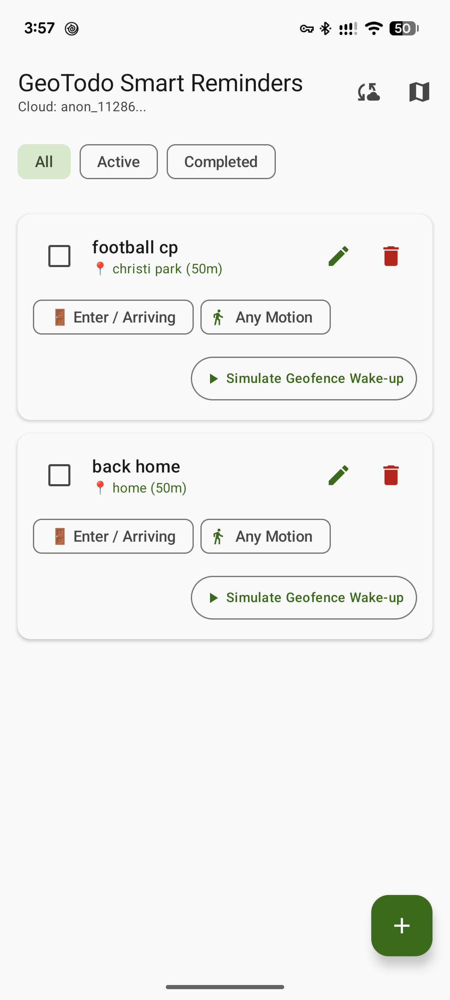
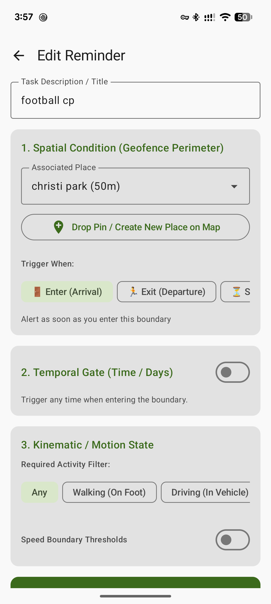
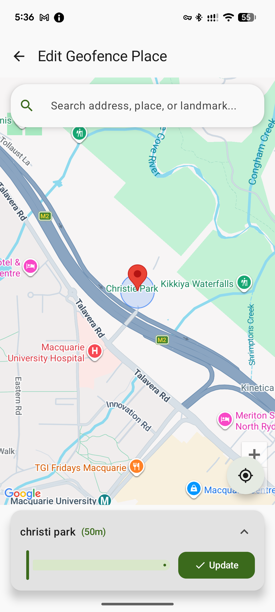
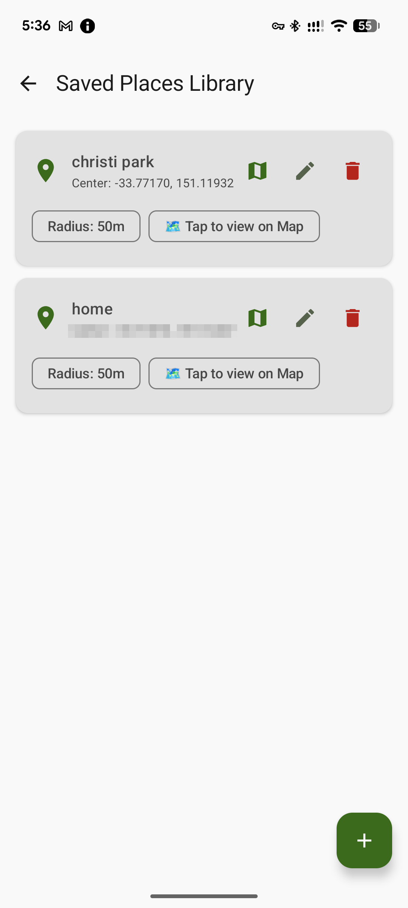
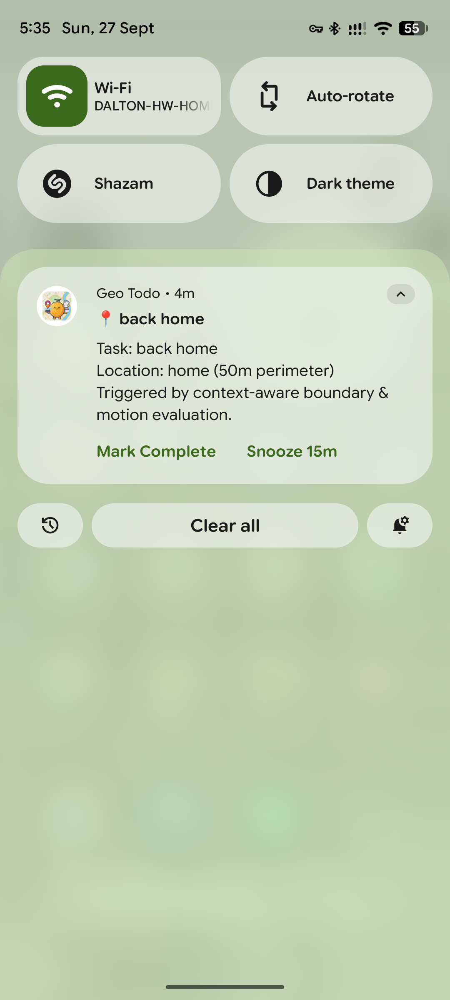
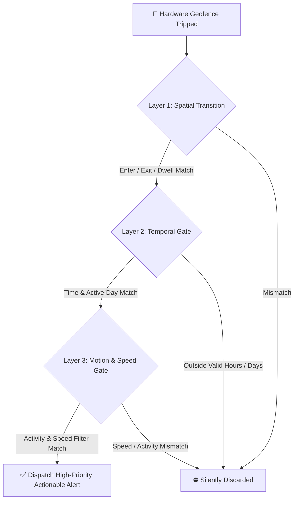

# 📍 GeoTodo — Context-Aware Smart Geofence Reminders for Android

[](https://kotlinlang.org)
[-green.svg?style=flat&logo=android)](https://developer.android.com)
[](https://developer.android.com/jetpack/compose)
[](https://developers.google.com/maps)
[](https://firebase.google.com)
[](LICENSE)

> **Never miss a reminder or get spammed at the wrong moment.**  
> **GeoTodo** is a modern, battery-efficient, context-aware Android reminder app and developer starter kit built with **Kotlin**, **Jetpack Compose (Material 3)**, **Google Maps SDK & Geocoding**, **Google Play Services Geofencing & Activity Recognition**, and **Firebase Cloud Sync**.

---

## 📱 App Showcase

<p align="center">
  
  
  
  
  
</p>

| 📋 **Task Dashboard** | ⚙️ **Rule Builder** | 🗺️ **Map & Address Search** | 📍 **Places Library** | 🔔 **Actionable Alerts** |
| :--- | :--- | :--- | :--- | :--- |
| Active/completed tasks with live trigger badges, quick edit, and instant on-device simulation. | Compose spatial boundaries, trigger transitions, daily time gates, and motion rules. | Google Maps with real-time address search bar, live geocoding, and expandable radius card. | Saved geofence places library with coordinate view, map viewing, and in-place editing. | Rich heads-up notifications with *"Mark Complete"* & *"Snooze 15m"* quick actions. |

---

## 🌟 Why GeoTodo?

Traditional reminder apps only offer static time alarms or naive GPS polling that rapidly drains battery. **GeoTodo** changes this with a **3-Layer Composite Context Engine**:



### 🎯 Key Highlights

* **🗺️ Interactive Map Picker & Address Search (10m – 1000m)**:
  * **Google Maps-Style Address Search Bar**: Type any street address, landmark, or business to automatically geocode, center, and zoom the camera.
  * **Expandable Bottom Perimeter Sheet**: Minimal collapsed slider bar or expanded view with coordinate display, place alias input, and one-tap preset radius chips (`10m`, `25m`, `50m`, `100m`, `200m`, `500m`, `1000m`).
  * **Smart Name Prompt Dialog**: If no name is provided on save, auto-prompts with background reverse-geocoded suggestions and quick chips (*Home, Work, Gym, Supermarket, School*).
* **📍 Saved Places Library**:
  * Manage saved locations with distance badges, exact coordinates, in-place quick editing, and one-tap map inspection.
* **🚪 Multi-Transition Trigger Conditions**:
  * 🚪 **Enter (Arrival)** — Alert the second you arrive (*e.g., grocery list at supermarket*).
  * 🏃 **Exit (Departure)** — Alert when leaving a place (*e.g., "Don't forget keys & umbrella" when leaving home*).
  * ⏳ **Stay inside (Dwell)** — Alert after remaining inside for ~30 seconds (*e.g., browse aisle items when browsing a store*).
  * 🔄 **Enter or Exit** — Alert on both arrival and departure.
* **⏰ Temporal Gating & Day Filtering**:
  * Define daily active hours (*e.g., only between 08:00 – 18:00*).
  * Day-of-week filters (*e.g., Weekdays only, Weekends only, or custom days*).
* **🏃 Kinematic / Motion & Speed Filters**:
  * Filter by user motion: **Walking (On Foot)**, **Driving (In Vehicle)**, **Stationary (Still)**, or **Any Motion**.
  * Speed threshold bounds (*e.g., only notify when walking past a bakery $\le 8\text{ km/h}$, but not when speeding past on a highway at $60\text{ km/h}$*).
* **🧪 On-Device Geofence Simulator**:
  * Test any combination of geofence transitions, velocities, and activity states instantly inside the app without needing to step outside.
* **☁️ Offline-First & Cloud Sync**:
  * Local-first persistence with **Room (SQLite)**.
  * Real-time bidirectional backup and synchronization with **Firebase Firestore & Anonymous Auth**.
* **✨ Modern Material 3 & Jetpack Compose UI**:
  * Edge-to-edge layout, dynamic theming, fluid scrollable filter chips, and smooth transitions.

---

## 🏗️ Architecture & Tech Stack

GeoTodo follows clean Android Architecture guidelines (MVVM + Repository Pattern):

```
app/src/main/java/com/melonapp/an_melon_geo_fence_todo/
├── data/
│   ├── local/          # Room Database (AppDatabase, TaskDao, PlaceDao, Entities)
│   ├── remote/         # Firestore Models & Cloud Sync
│   └── repository/     # TaskRepository, LocationRepository, AuthRepository
├── engine/             # CompositeTriggerEvaluator, GeofenceManager, NotificationHelper, MotionManager
├── receiver/           # GeofenceBroadcastReceiver, ActivityTransitionReceiver, NotificationActionReceiver
├── ui/
│   ├── components/     # SimulationDialog, Permission Rationale Dialogs
│   ├── navigation/     # Jetpack Navigation Routes
│   ├── screens/        # TaskListScreen, TaskEditScreen, MapLocationPickerScreen, PlacesListScreen
│   └── viewmodel/      # TaskViewModel, LocationViewModel, AuthViewModel
└── GeoTodoApplication.kt
```

### 🛠️ Built With

* **Language**: [Kotlin 2.0.21](https://kotlinlang.org)
* **UI Toolkit**: [Jetpack Compose](https://developer.android.com/jetpack/compose) with [Material 3](https://m3.material.io)
* **Architecture**: Android Jetpack ViewModel, StateFlow, Coroutines
* **Local Storage**: [Room Database 2.7.0](https://developer.android.com/training/data-storage/room)
* **Cloud & Auth**: [Firebase Firestore](https://firebase.google.com/docs/firestore) & [Firebase Auth](https://firebase.google.com/docs/auth)
* **Maps & Geocoding**: [Google Maps Compose SDK 6.1.2](https://github.com/googlemaps/android-maps-compose) & Android Geocoder
* **Location & Geofencing**: [Google Play Services Location 21.3.0](https://developers.google.com/android/reference/com/google/android/gms/location/package-summary)
* **Activity Recognition**: [Google Play Services Location Activity Recognition](https://developers.google.com/location-context/activity-recognition)
* **Dependency Injection & Async**: Coroutine Scope & Structured Concurrency

---

## 🚀 Getting Started

### 1. Prerequisites
* **Android Studio**: Ladybug (2024.2.1+) or newer
* **JDK**: Version 17 or 21
* **Android Device / Emulator**: Running Android 8.0 (API 26) or higher with Google Play Services.

### 2. Clone the Repository
```bash
git clone https://github.com/<your-username>/an-melon-geo-fence-todo.git
cd an-melon-geo-fence-todo
```

### 3. Setup Firebase & Google Maps
1. **Google Maps API Key**:
   * Obtain a Google Maps API Key from the [Google Cloud Console](https://console.cloud.google.com/google/maps-apis).
   * Add your API key in `app/src/main/AndroidManifest.xml`:
     ```xml
     <meta-data
         android:name="com.google.android.geo.API_KEY"
         android:value="YOUR_GOOGLE_MAPS_API_KEY" />
     ```
2. **Firebase Configuration**:
   * Create a project in the [Firebase Console](https://console.firebase.google.com/).
   * Enable **Anonymous Authentication** and **Cloud Firestore**.
   * Download `google-services.json` and place it in the `app/` directory (`app/google-services.json`).

### 4. Build & Run
* **Run Unit Tests**:
  ```bash
  ./gradlew testDebugUnitTest
  ```
* **Build Debug APK**:
  ```bash
  ./gradlew assembleDebug
  ```
* Output APK will be located at:
  `app/build/outputs/apk/debug/app-debug.apk`

---

## 💡 Perfect As A Starter Template

Want to build location-aware or context-driven mobile apps? **GeoTodo** serves as a production-grade template for:
- 📦 **Smart Logistics & Delivery Alerts** (notify couriers when entering loading bays or stopping at customer addresses).
- 🏪 **Proximity Retail & Loyalty Apps** (welcome visitors when entering and remind discounts when leaving).
- 🏃 **Fitness & Habit Trackers** (trigger hydration alerts when finishing a run or leaving the gym).
- 👨‍👩‍👧 **Parental & Safety Geofences** (track arrival/departure at schools or safe zones).

---

## 🤝 Contributing

Contributions, issues, and feature requests are very welcome!
1. Fork the Project
2. Create your Feature Branch (`git checkout -b feature/AmazingFeature`)
3. Commit your Changes (`git commit -m 'Add some AmazingFeature'`)
4. Push to the Branch (`git push origin feature/AmazingFeature`)
5. Open a Pull Request

---

## 📄 License

Distributed under the GNU General Public License v3.0. See [`LICENSE`](LICENSE) for more information.
